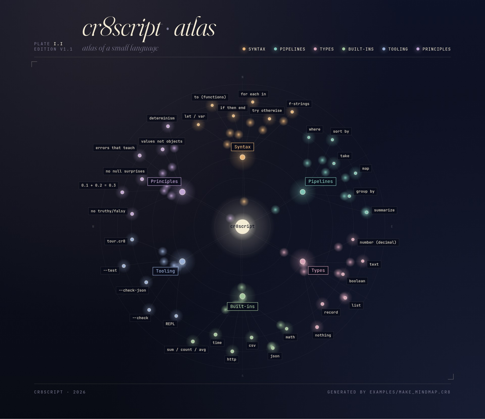

# cr8script

An English-shaped scripting language for LLMs and anyone who wants quick
scripts without Python's footguns. One file. No build. No imports. Reads
the way you'd describe the work out loud.



## Quick start

```bash
python3 cr8script.py examples/tour.cr8        # the language tour
python3 cr8script.py                          # REPL
python3 cr8script.py --test                   # run the golden suite
```

Python 3.9+. No pip, no venv, no flags.

## A taste

```
let sales = [
  { product: "widget", region: "east", amount: 12.50 },
  { product: "gadget", region: "east", amount:  8.00 },
  { product: "widget", region: "west", amount: 15.00 },
  { product: "doodad", region: "east", amount: 99.00 },
]

let by_product = sales
  | group by product
  | summarize { total: sum(amount), n: length(items) }
  | sort by total descending

for each row in by_product
  show f"{row.product}: {row.total} across {row.n} order(s)"
end
```

```
doodad: 99 across 1 order(s)
widget: 27.5 across 2 order(s)
gadget: 8 across 1 order(s)
```

`examples/tour.cr8` walks the rest of the language end-to-end.

## What makes it different

- **Reads like English.** `is greater than`, `is at least`, `for each`,
  `where`, `sort by`. No `==`, `!=`, `>=`, `<=`.
- **Honest types.** No truthy/falsy. `"5" + 3` is an error. `5 is "5"` is
  an error. `if 0 then` is an error.
- **Honest decimals.** `0.1 + 0.2` is exactly `0.3`. One number type.
- **No null surprises.** Only `nothing`. Indexing a missing key returns
  `nothing`; typing the wrong field name is a hard error with a "did you
  mean" hint.
- **Immutable by default.** `let` is forever; `var` opts into change.
- **Pipelines as a first-class verb set.** `where`, `sort by`, `take`,
  `map`, `group by`, `summarize` — bare names inside resolve to record
  fields.
- **Errors that teach.** Every error names the line, the value, and a
  one-line hint.
- **LLM-shaped diagnostics.** `--check-json` emits structured `{ line,
  message, hint }` so a model can self-correct before running.

## For language models

[`LLMS.md`](LLMS.md) is a condensed grammar + rules sheet aimed at any
model asked to read or write `.cr8` code. The self-correction loop is:

```bash
python3 cr8script.py --check-json file.cr8     # structured diagnostics
python3 cr8script.py file.cr8                  # run
```

## Status

v1.1. Single-file Python interpreter (`cr8script.py`, ~2.8k lines):
lexer, parser, tree-walking evaluator, REPL, static checker, ten golden
tests. The *language* is independent of Python — only the bootstrap is.

Built-in modules: `math`, `http`, `time`, `json`, `csv`. Top-level:
`length`, `sum`, `count`, `average`, `min`, `max`, `range`, `to_text`,
`to_number`, `keys`, `type`, `assert`. Strings support `f"..."`
interpolation.

Out of scope until pulled by a real use case: regex, file I/O, dates,
modules / imports, async. **Not** on the roadmap: classes (values, not
objects).

## Layout

```
cr8script.py     single-file interpreter
LLMS.md          rules-and-grammar sheet for LLMs
examples/        hello, tour, load_test, make_game, make_mindmap
testdata/        golden tests
mindmap.html     the atlas, animated in the browser
game.html        a small playable demo (output of make_game.cr8)
```

## More

```bash
python3 cr8script.py --check file.cr8          # static checks (human output)
python3 cr8script.py --check-json file.cr8     # static checks (JSON output)
python3 cr8script.py --lex file.cr8            # token dump (debugging)
python3 cr8script.py --ast file.cr8            # AST dump  (debugging)
```
